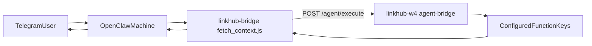

# Piano operativo E2E Fly.io + Telegram (nomi reali)

## Stato verificato

- Route bridge attive in host Convex: `POST /agent/execute`, `GET /agent/functions` tramite `registerAgentBridgeRoutes(http)` in [linkhub-w4/convex/http.ts](/Users/williamzisa/Coding/linkhub-w4/convex/http.ts) e [linkhub-w4/convex/agentBridge.ts](/Users/williamzisa/Coding/linkhub-w4/convex/agentBridge.ts).
- FunctionKey reali disponibili nel bridge in [linkhub-w4/agent-bridge.config.ts](/Users/williamzisa/Coding/linkhub-w4/agent-bridge.config.ts):
  - `users.me`
  - `objectives.getAllForCurrentUser`
  - `initiatives.getAllForCurrentUser`
  - `initiatives.getImpactDetails`
  - `initiatives.checkIn`
- Lo script skill attuale usa un functionKey inesistente (`getOkrContext`) in [openclaw-okr-image/skills/linkhub-bridge/scripts/fetch_context.js](/Users/williamzisa/Coding/openclaw-okr-image/skills/linkhub-bridge/scripts/fetch_context.js), quindi oggi fallisce lato bridge.

## Flusso target

## Piano punto per punto

### 1) Allineare la skill ai functionKey reali del bridge

- Aggiornare [openclaw-okr-image/skills/linkhub-bridge/scripts/fetch_context.js](/Users/williamzisa/Coding/openclaw-okr-image/skills/linkhub-bridge/scripts/fetch_context.js) per rimuovere `getOkrContext`.
- Implementare chiamate `/agent/execute` con `functionKey` reali:
  - minimo consigliato: `users.me`, `objectives.getAllForCurrentUser`, `initiatives.getAllForCurrentUser`.
  - opzionale su richiesta utente: `initiatives.getImpactDetails` (se serve dettaglio su iniziativa specifica).
- Restituire a OpenClaw un JSON unico composto dai risultati delle chiamate.

### 2) Gestire il requisito auth user-mode del bridge

- In `agent-bridge.config.ts`, i functionKey selezionati hanno `authMode: "user"`.
- Lo script skill deve quindi poter inviare anche `Authorization: Bearer <user-jwt>` oltre agli header strict.
- Definire il meccanismo runtime per ottenere/passare il JWT utente al container (es. env per sessione o injection applicativa lato trigger host).

### 3) Mantenere il contratto strict headers coerente

- Confermare in script skill l’invio di:
  - `X-Agent-Service-Id`
  - `X-Agent-Service-Key`
  - `X-Agent-App` (default attuale: `linkhub-w4`)
- Verificare allineamento con `AGENT_BRIDGE_SERVICE_KEYS_JSON` nel deployment Convex host.

### 4) Validare immagine OpenClaw runtime

- Verificare Node disponibile nella image buildata (`node --version`) secondo [openclaw-okr-image/Dockerfile](/Users/williamzisa/Coding/openclaw-okr-image/Dockerfile).
- Verificare script eseguibile e sintassi shell/Node secondo:
  - [openclaw-okr-image/entrypoint.sh](/Users/williamzisa/Coding/openclaw-okr-image/entrypoint.sh)
  - [openclaw-okr-image/skills/linkhub-bridge/scripts/fetch_context.js](/Users/williamzisa/Coding/openclaw-okr-image/skills/linkhub-bridge/scripts/fetch_context.js)

### 5) Verificare provisioning policy lato fly-agents

- Confermare che `provisionAgentMachine` imposti env bridge e skill whitelist minima:
  - `AGENT_BRIDGE_URL`
  - `OPENCLAW_SERVICE_ID`
  - `OPENCLAW_SERVICE_KEY`
  - `OPENCLAW_APP_KEY`
  - `ALLOWED_SKILLS_JSON` (default `['linkhub-bridge']`)
- File di riferimento: [fly-agents/src/component/lib.ts](/Users/williamzisa/Coding/fly-agents/src/component/lib.ts).

### 6) Test incrementali (prima locale, poi Fly)

- Test A: script standalone in container (`node .../fetch_context.js`) con env bridge validi.
- Test B: chiamata a `/agent/functions` per verificare discoverability dei functionKey reali.
- Test C: chiamata a `/agent/execute` per `users.me` con/ senza Authorization (atteso: senza JWT deve fallire su funzioni user-mode).
- Test D: chiamata sequenziale a più functionKey e verifica JSON aggregato finale.

### 7) Test end-to-end Telegram

- Avviare macchina Fly provisionata via `fly-agents`.
- Inviare messaggio Telegram che triggera la skill `linkhub-bridge`.
- Verificare:
  - log OpenClaw (invocazione script + output)
  - log Convex bridge (`/agent/execute` 200)
  - assenza 401/403 dovuti a header o JWT mancanti
  - risposta finale al canale Telegram.

### 8) Hardening pre-produzione

- Ridurre payload aggregato per evitare contesto eccessivo nel prompt.
- Mascherare dati sensibili nei log script.
- Definire timeout/retry per ciascuna chiamata `/agent/execute`.
- Documentare in [fly-agents/dev_utils/t3-instructions.md](/Users/williamzisa/Coding/fly-agents/dev_utils/t3-instructions.md) il mapping definitivo `skill -> functionKey reali`.

## Criteri di successo

- Nessun riferimento operativo a `getOkrContext`.
- La skill usa solo functionKey reali del bridge configurato in `linkhub-w4`.
- Le chiamate user-mode funzionano con JWT utente valido.
- Test E2E Telegram risponde correttamente con contesto OKR reale.

